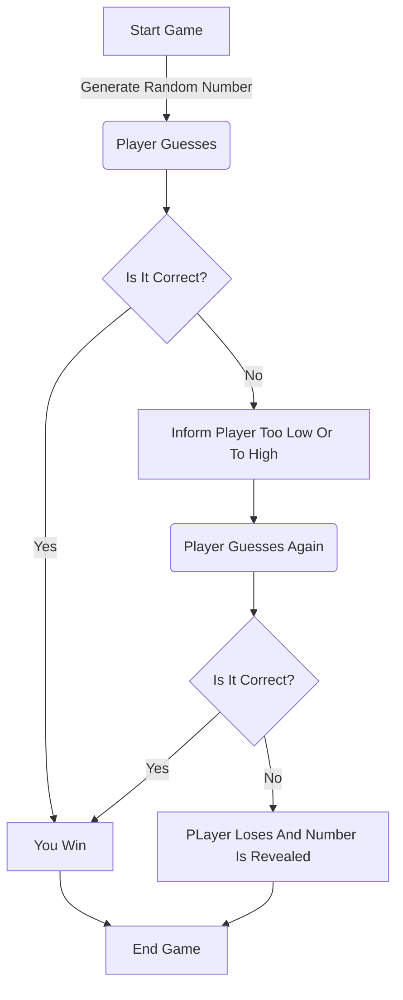

```mermaid
graph TB
    A[Start Game] -->|Generate Random Number| B(Player Guesses)
    B --> C{Is It Correct?}
    C -->|Yes| D[You Win]
    C -->|No| E[Inform Player Too Low Or To High]
    E --> F(Player Guesses Again)
    F --> G{Is It Correct?}
    G -->|Yes| D[You Win]
    G -->|No| H[PLayer Loses And Number Is Revealed]
    D --> I[End Game]
    H --> I[End Game]
```